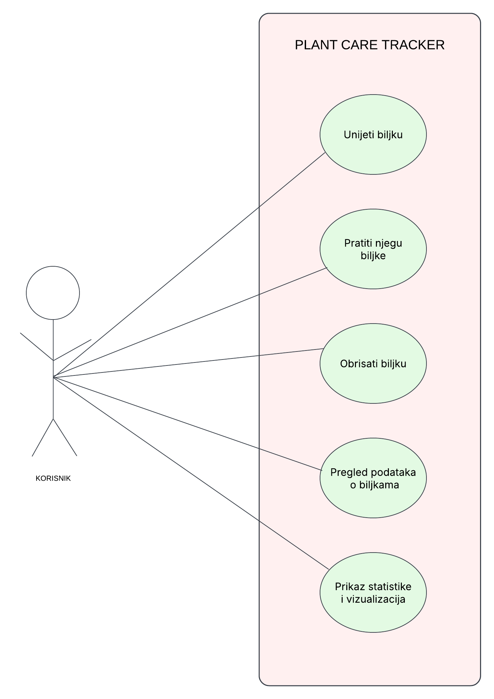

# Plant Care Tracker
### Martina Ilić (0303121636)
## Opis projekta
Plant Care Tracker je web aplikacija za praćenje zalijevanja i prihrane biljaka. Omogućuje dodavanje, uređivanje, brisanje i pregled biljaka. Aplikacija prikazuje osnovnu statistiku kroz vizualizacije.
## Tehnologije

- Python 3.12
- Flask (web framework)
- Pony ORM (za rad s bazom podataka)
- SQLite (baza podataka)
- Bootstrap (frontend stilizacija)
- Chart.js (za vizualizaciju podataka)
- Docker (za pokretanje aplikacije)

## Funkcionalnosti
- CRUD operacije nad biljkama (dodavanje, pregled, uređivanje, brisanje)
- Praćenje zadnjeg i sljedećeg zalijevanja i prihrane
- Vizualizacije podataka o biljkama pomoću Chart.js
- Jednostavno pokretanje pomoću Dockera

## Kako pokrenuti projekt

### Pokretanje s Dockerom

1. Provjerit da imate instaliran Docker na svom računalu.

2. Iz korijenske mape projekta (gdje se nalazi `Dockerfile`), pokreni:

    ```bash
    docker build -t plant-tracker .
    ```

3. Pokreni Docker container :

    ```bash
    docker run -p 5001:5000 plant-tracker
    ```

4. Otvori preglednik na adresi:  
   [http://localhost:5001/home](http://localhost:5000/home)

## Use case dijagram




---
